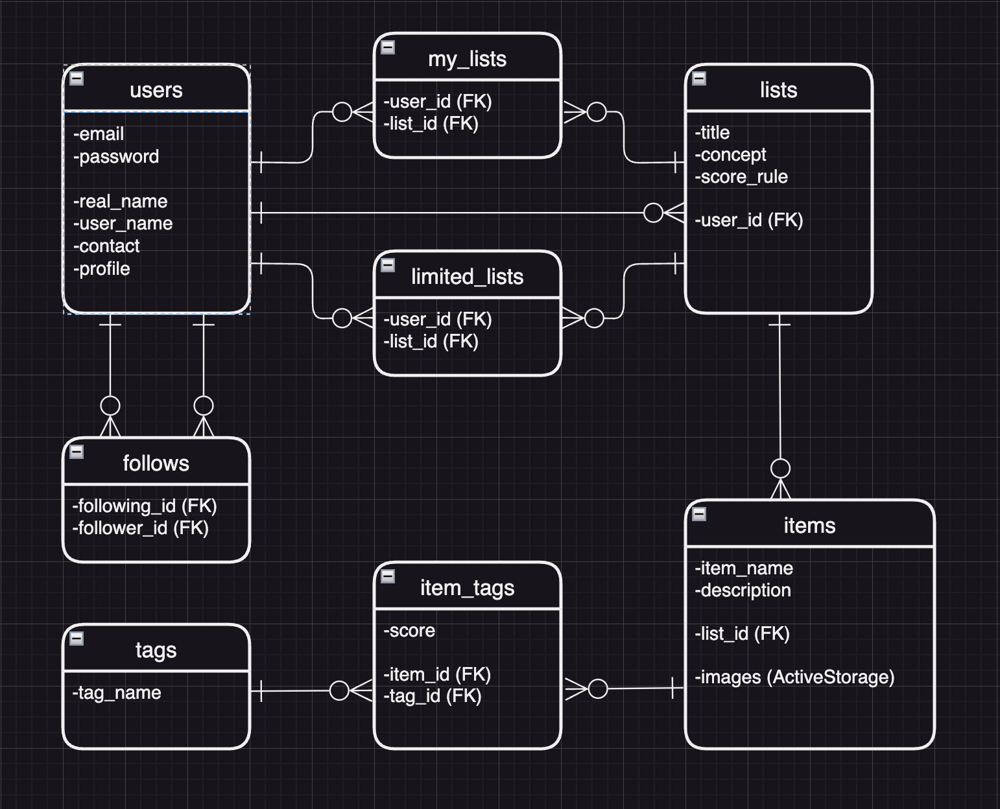
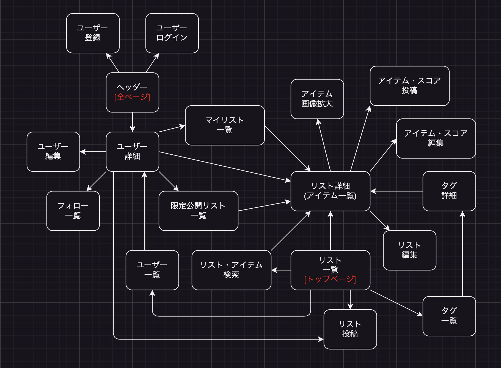

# アプリケーション名
Five Level Tagging　(5段階タグ付けアプリ)  
 

# アプリケーションURL
http://3.115.163.111/  

※Basic認証(ID/Pass)、テスト用アカウント(メールアドレス/パスワード)は、履歴書・職務経歴書に記載。
 
 

# アプリケーション概要
(1)リストの各項目(アイテム)に最大4種の「特徴タグ」と「5段階スコア」を登録することで、特徴の数値化・一覧化ができる。  

(2)他ユーザーの作ったリストやアイテム(タグ・スコア)も含め、並び替え・検索ができる。  
 

## アプリケーションの使用例
(1)音楽・書籍・映像など各種作品の、評価項目と評価値をリスト化する。  
　「泣ける:1」「怖い:5」の映画など。  
 
(2)献立ストックリストを検索。献立の組み合わせを考えやすくする。  
　「甘さ:3」「食べ応え:2」のプリンと、「塩味:2」「食べ応え:3」の厚焼きせんべい。  
 
(3)行事ストックリストを作成。実施難易度の高さで5段階数値化。行事の実施時期・順番を考えやすくする。  
　「よける:2」「協力:1」「危険性:2」のチーム鬼ごっこで、簡単な運動遊び・協力遊びを4月に企画する。  
　「よける:3」「協力:3」「危険性:3」のドッジボールは、身体能力や協調性の成長を見計らって、7月を目安に企画する。  
 

## アプリケーションを作成した背景
　保育士時代、過去の献立や行事を参照したい時、毎月の献立表や個別の行事報告書を何枚もめくって探すような、アナログな環境だった。  
　改善策として、エクセルで記録を一覧化し、蓄積・検索しやすくした。  
　献立や行事の特徴と程度(タグとスコア)も簡潔に記録することで、「体験」の組み合わせや順番に意図を込めて計画しやすくなった。  
　便宜的・簡易的な数値化により、抽象的・曖昧な事柄についても、特徴の把握・比較と選択がしやすくなった。  
　ただし、当時はあくまでイチ施設内で完結する記録であった。  
 
　今回、アプリ化して公開することで、メリットをさらに発展させられると考えた。  
　他ユーザーの作ったリストやアイテム(タグ・スコア)も参照できるようになる。  
　異なる他者の経験・アイディア・価値尺度に出会い、刺激やヒントを得られる。  
　公開リストなら見知らぬ人と、限定公開リストなら企業内やチーム内で、共同編集も可能になる。  
　今回はリスト・タグのジャンルを限定しないことで、様々な業務あるいは趣味の記録にも対応可能性を広げた。  
　(仮に大規模市場または特定業界向けで運用するなら、ジャンル別のUIやDBでアプリを独立させた方が実用的か。)  
 
 

# 実装済みの機能
### 1. リストの投稿
(1)トップページ(＝リスト一覧ページ)にアクセスする。ヘッダーからユーザー登録・ログインする。  
 

# 実装予定の機能
### 1. リストの投稿
(2)リスト新規投稿をクリックする。  
(3)リストのタイトル・コンセプト・数値化ルールを入力して投稿する。  
　※数値化ルールには、スコア1~5それぞれの段階・程度を表す言葉や代表例などの記載を推奨。  
 

### 2. アイテム(リスト内の各項目)・タグ・スコアの投稿
(1)リスト一覧ページで、自作のリストタイトル(リスト詳細ページ)をクリックする。  
(2)リスト詳細ページで、アイテム新規投稿をクリックする。  
(3)アイテムの項目名・説明・タグ・スコアを入力し、画像を添付して投稿する。  
　※タグとスコアは最大4組入力できる。タグのみの保存はできるが、タグに紐づかないスコアのみの保存はできない。  
 

### 3. リスト一覧・アイテム一覧の並び替え
(1)リスト一覧ページの並び替えボタン3種をクリックするたびに、昇順・降順を切り替える(投稿日時・タイトル・作者名)。  
(2)アイテム一覧ページ(＝リスト詳細ページ)の並び替えボタン3種をクリックするたびに、昇順・降順を切り替える(投稿日時・項目名)。  
　※アイテムに紐づくタグ・スコアも、アイテムごと並び換えられる。  
 

### 4. ユーザー詳細ページの表示
 

### 5. リスト・アイテムの検索
 

### 6. タグの検索
 

### 7. ユーザーのフォロー
 

### 8. リストのマイリスト登録
 

### 9. 全体公開リスト・限定公開リストの選択投稿
 

### 10. アイテムの画像拡大
 

### 11. 使い方ガイドの表示ボタン(非同期通信)
 

### 12. CSSの装飾
※開発中アプリにつき、ユーザー目線の説明やレイアウト装飾は、一通りの機能実装後に着手する。
 
 

# 要件定義
[リンク：Googleスプレッドシート](https://docs.google.com/spreadsheets/d/10B7zKWsc7uPWMbjWP8jSZ0URIDiKXv5PVb-Rytln0PM/edit#gid=219665282)  
 

# データベース設計

 
 

# 画面遷移図

 
 

# 開発環境
HTML・CSS・Ruby・JavaScript・SQL・GitHub・AWS  
[リンク：GitHubリポジトリ](https://github.com/avocado-don/five_level_tagging)  
[リンク：GitHubプロジェクトボード](https://github.com/users/avocado-don/projects/2/views/1)  
 

# 工夫した点
※別の実験用アプリ(ローカル環境)にて実験したコード。近日中に本アプリで実装予定。  
　上記「実装予定の機能」の「2. アイテム(リスト内の各項目)・タグ・スコアの投稿」に該当。  
 

◎1つのアイテムに紐づく4組のタグとスコアを、アイテム投稿ボタン1クリックで保存可能にする。  
 

(1)テーブル設計：アイテム、タグ、中間テーブル(スコアも含めて保存)。  

　カラムの正規化の観点から、1アイテムのカラムに4組の同種データを保存することはしない。他のテーブルに4つのレコードとして保存する。  
　タグとスコアの組み合わせは、1アイテムに固有の情報である。一方で、タグ自体は他ユーザー・他リストでの使い回し・検索に対応させる。  
　従って、タグテーブルにはスコアを含めず、タグ名のみ保存する。スコアは、中間テーブルにアイテムID・タグIDと共に保存する。  
 

(2)入力フォーム：タグ・スコアの入力欄を4つずつ設置。(タグ1→スコア1→タグ2→スコア2→…の順番。)  

　複数タグの一括入力方法として、1つの入力欄内でスペースやカンマで区切る方法は採用しない。  
　1つのタグ入力欄にどのスコア入力欄が紐づいているか、ユーザーの視覚・直感を考慮し、入力欄を並べた。  
 

(3)タグ(tag_name)・スコア(score)4つずつを、配列に格納して送信。  

　text_fieldのname属性をitem_form[tag_names][]
、item_form[scores][]と設定。  
 

(4)ストロングパラメーターで配列の受け取りを許可。  

　params.require(:item_form).permit(tag_names: [], scores: [])と設定。(※他のキーは記載省略。)  
 

(5)フォームオブジェクト(ItemForm)のattr_accessorで、tag_namesとscoresを指定。  
 

(6)フォームオブジェクト内でsaveメソッドを作り、配列内の値を4つのレコードに分けて保存。  

　メソッド内で、アイテム、タグ、中間テーブル(スコアも含む)を順次保存する。アイテムは入力必須、タグとスコアは入力任意。  

　タグが存在している場合(if tag_names.present?
)、タグの配列にeach_with_indexメソッドを使う。メリットは2つ。  

　メリット1(each)：配列tag_namesから順次取り出したtag_nameにfirst_or_initializeメソッドを使い、同名のタグが過去に存在しない場合にタグを保存する。  

　メリット2(with_index)：タグの配列に添字を付与する。index0~3。tag_names[0]を取り出している間は、同じ添字でscores[0]も取り出せる。  
　タグに紐づいたスコアが存在している場合のみ(if scores[index].present?
)、アイテム・タグ・スコアの紐付けを保存する。(スコアが存在しなければ、アイテム・タグのみの紐付けを保存。)  

　タグが存在しない場合、タグに紐づかないスコアだけを保存することはないので、アイテムのみ保存する。  
 
