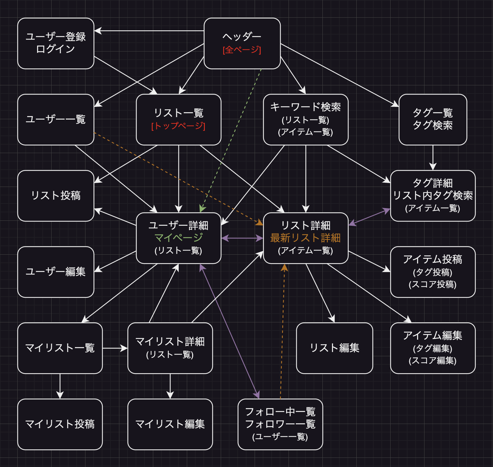

　※記載内容および画像は、全て開発中のもの。CSSによるレイアウト装飾(配色・フォントなど)は、一通りの機能実装後に着手する予定。  
 
 

# [ 1 ] アプリケーションの概要
## 1-1. アプリ名称
　Five Level Tagging 【5段階タグ付けアプリ】  
 
 

## 1-2. 本番環境URL
　http://3.115.163.111/  
 
 

## 1-3. テスト用アカウント
　(1)企業風アカウント：user1　メールアドレス：aaaa@jp　パスワード：1aaaaaa8  
 
　(2)個人風アカウント：user2　メールアドレス：bbbb@jp　パスワード：2bbbbbb8  
 
　※Basic認証(ID/Pass)：履歴書・職務経歴書に記載。  
 
　※テスト用アカウントにログインして閲覧する皆様へ  
　既存データ(サンプルデータ)の編集・削除はご遠慮ください。(user1〜2, list1〜6, item1〜72)  
　新規データの投稿・編集・削除は問題ございません。データベースリセットの目安：平日22時頃  
 
 

## 1-4. アプリ使用方法の概要
### 1-4-1. リスト(アイテム一覧表)を投稿し、各アイテムにタグと5段階スコアを設定する
　(1)ユーザーが自由に決めたテーマに基づき、記録・発信したい情報を投稿できる(企業の業務や、個人の趣味)。  
　情報を一覧化するページとして「リスト」を投稿する。リスト内の個々の項目として「アイテム」を投稿する。  
 
　(2)アイテムの特徴を示すキーワードとして「タグ」を投稿する。アイテム1つにつき、最大4つ。  
　タグの程度や段階を示す数値として、「1」~「5」の「スコア」を投稿する。  
　これにより、アイテムが持つ特徴を5段階の数値で表現し、データベース化できる。  
 
　(3)自作リスト内のアイテム一覧表を並び替える(ドラッグ＆ドロップ)。順番を指定して保存できる。  
 
　(4)自作リストの権限を設定する。閲覧可能なユーザーや、共同編集可能なユーザーを指定できる。  
 
 

### 1-4-2. リストやユーザーを検索・閲覧する
　(1)リスト(詳細ページ)へのアクセス機能：リスト一覧、キーワード検索、タグ検索、マイリストなど。  
　ユーザー一覧やフォロー一覧からは、各ユーザーが更新した最新リストにアクセスできる。  
 
　(2)ユーザー(詳細ページ)へのアクセス機能：ユーザー一覧、フォロー一覧、リスト一覧(各リストの作者名)など。  
 
　(3)ユーザーやリストやアイテムの一覧表をソートする。更新日時順、五十音順、スコア順、作者指定順など。  
 
 

## 1-5. アプリ活用例
　(1)音楽・書籍・映像など、鑑賞作品の評価項目と評価値をリスト化する。  
　「感動:1」「怖い:5」の映画  
 
　(2)食品リストを検索。おやつ献立の組み合わせを考えやすくする。満腹感のスコア合計6を目安にした場合↓  
　「満腹感:1」ミニゼリー＋「満腹感:2」薄焼きせんべい＋「満腹感:3」カットバウム  
　「満腹感:2」薄焼きせんべい＋「満腹感:4」カットロールケーキ  
　「満腹感:1」ミニゼリー＋「満腹感:5」肉まん  
 
　(3)小学生低学年向けの運動遊び計画を作成。難易度を数値化。運動遊びの実施時期・順番を考えやすくする。  
　「走る:1」ドーンじゃんけん  
　「走る:2」ハンカチ落とし  
　「避ける:1」おしり鬼ごっこ  
　「走る:3」「避ける:2」こおり鬼ごっこ  
　「狙う:1」ボール転がし的当て  
　「狙う:2」「避ける:3」転がしドッジボール  
　「狙う:2」「キャッチ:1」キャッチボール(ドッジ用ボール)  
　「狙う:2」「キャッチ:2」パスリレー(ドッジ用ボール)  
　「狙う:3」「キャッチ:3」アメリカンドッジボール  
　「狙う:4」「避ける:4」外野なしドッジボール  
　「狙う:4」「避ける:5」外野ありドッジボール  
　「走る:3」「狙う:5」「避ける:4」三歩ドッジボール  
 
 

## 1-6. アプリを作成した背景
### 1-6-1. 業務実績：情報をリスト化・タグ化・数値化し、特徴の把握や比較を効率化した
　(1)保育士時代、献立や活動の記録を手書きで作成してファイリングするのが慣例、という職場を複数経験した。  
　新たな計画を立てる際、過去の献立や活動を参照しつつも、丸被りは避けたい。献立や活動の実施時期や順番、実施の意図や効果・評価を、数年単位で比較したい。数年分の記録を何枚もめくって探し、読み比べていた。  
 
　(2)改善策として、PCで記録入力の雛形を作った。献立や活動のデータを一覧化し、検索しやすくした。献立や活動の簡潔な特徴と評価値(タグとスコア)も記録し、共通タグやスコア順での一覧表ソートも可能にした。  
 
　(3)便宜的・簡易的な数値化により、本来定量的でない保育活動も、特徴の把握と比較・選択がしやすくなった。  
　保育を通じて児童に提供したい「体験」の組み合わせや順番に、意図を込めて計画しやすくなった。  
　経験知を蓄積・共有し、職員が異動しても継承しやすくなった。ただし、あくまで私の職場内で完結していた。  
 
 

### 1-6-2. アプリ化利点：リストをユーザーが投稿・検索し合い、多様な情報や発想に出会える
　(1)そこで、特徴のタグ・スコア化機能をアプリに落とし込めば、ユーザー間の双方向性を強化できると考えた。  
　検索機能やフォロー機能を使い、他者の投稿したリストを発見できる。リスト作者の考えが反映されたタグやスコアを見て、自分と異なる経験や発想、価値観や価値基準に出会い、刺激やヒントを得るチャンスを増やせる。  
 
　(2)さらに、リスト権限設定機能を使い、特定のメンバー内でリストの限定公開や共同編集ができる。企業内やプロジェクトチーム内、コミュニティの仲間内や家族内、あるいはネット上・アプリ上で知り合った人など。  
 
　(3)今回はリスト・タグのジャンルを限定しないことで、幅広い業務や趣味の記録に活用できる汎用性を高めた。  
　※特定業界向けに開発する場合は、UIやDB設計を特定のジャンル・ターゲットに寄せた方が実用的だと考える。  
 
 
 

# [ 2 ] アプリケーションの機能
## 2-1. 実装済みの機能
### 2-1-0. ユーザー登録、ログイン、ログアウト
　(0)アプリのトップページにアクセスする。Basic認証のIDとPassを入力すると、アプリを閲覧可能になる。  
 
　(1)ヘッダー(全ページで共通)：ユーザー登録／ログインをクリックする。  
　※ログイン中はボタンが変化：ユーザー登録→マイページ／ログイン→ログアウト。  
 
http://3.115.163.111/  
feature.png)
 
 
 
　(2)ユーザー登録ページ：Eメール、パスワード、本名、ユーザー名、連絡先、自己紹介を入力して送信する。  
 
/users/sign_up  
feature.png)
 
 
 
　(3)ログインページ：Eメール、パスワードを入力して送信する。  
 
/users/sign_in  
feature.png)
 
 
 

### 2-1-1. リスト一覧やアイテム一覧の表示・並び替え、省略されたテキストの開閉
　(1)ヘッダー：リスト一覧をクリックする。  
　(2)リスト一覧ページ(トップページ)：並び替えボタン(列の見出し)をクリックすると、昇順・降順を切り替えられる(リストタイトル、作者名、リスト更新日時)。  

　(3)長いテキストの表示は省略される(コンセプトが6行以上)。開閉ボタン(枠内右下)をクリックすると、表示の展開と折りたたみを切り替えられる。  
 
/lists  
feature.png)
 
 
 
　(4)リスト詳細ページ(アイテム一覧)：並び替えボタンをクリックすると、昇順・降順を切り替えられる(作者指定順、アイテム名、アイテム更新日時)。  

　(5)長いテキストの表示は省略される(コンセプト・リスト作成ルールが9行以上、アイテム説明が11行以上、画像が3枚以上)。開閉ボタン(枠内右下)をクリックすると、表示の展開と折りたたみを切り替えられる。  
 
/lists/1  
feature.png)
 
feature.png)
 
 
 

### 2-1-2. リストの投稿
　(1)ヘッダー：ログイン中に、リスト一覧／マイページをクリックする。  
　(2)リスト一覧ページ／マイページ：リスト新規投稿をクリックする。  
　(3)リスト投稿ページ：リストのタイトル、コンセプト、作成ルールを入力して送信する。  
 
/lists/new  
feature.png)
 
 
 

### 2-1-3. アイテム(リスト内の各項目)・タグ・スコアの投稿、タグ入力時の逐次検索
　(1)ヘッダー：ログイン中に、リスト一覧／マイページをクリックする。  
　(2)リスト一覧ページ／マイページ：自作のリストタイトルをクリックする。  
　(3)リスト詳細ページ：アイテム新規投稿をクリックする。  
 
　(4)アイテム投稿ページ：アイテムの名前、説明、画像(最大4枚)、タグとスコア(最大4組)を入力して送信する。  
　※投稿可能：アイテムのみ。アイテム＋タグ。アイテム＋タグ＋スコア。  
　※投稿不可：タグのみ。スコアのみ。タグ＋スコア。  
 
　(5)タグ名に入力した文字が、既存のタグ名と部分一致した場合、タグ名ボタンを表示。クリックして入力する。  
 
/lists/1/items/new  
feature.png)
 
 
 

### 2-1-4 自作リストのアイテム一覧：ドラッグ＆ドロップによる並び替え・順番保存
　(1)ヘッダー：ログイン中に、リスト一覧／マイページをクリックする。  
　(2)リスト一覧ページ／マイページ：自作のリストタイトルをクリックする。  
 
　(3)リスト詳細ページ：現在の並び替えボタンの表示が「並び替え（作者指定順） ▲」であることを確認する。  
　※他の並び替え方法が指定されている場合、作者指定順ボタンが▲表示(昇順)になるまでクリックする。  
 
　(4)アイテム名またはアイテム番号の部分にカーソルを合わせ、ドラッグを開始する。  
　半透明化したアイテムを上下に動かし、他のアイテムの合間にドロップする。  
 
　(5)アイテム一覧を任意の順番に並び替えることで、新たなアイテム番号を保存・表示できる。  
　他のユーザーが閲覧する際も、リスト作者が指定した番号順にアイテム一覧が表示される。  
 
/lists/6  
feature.gif)
 
 
 

### 2-1-5. ユーザー一覧(および各ユーザーの最新リスト)の表示・並び替え、マイページの表示
　(1)ヘッダー：ユーザー一覧をクリックする。  
　(2)ユーザー一覧ページ：並び替えボタン(列の見出し)をクリックすると、昇順・降順を切り替えられる(ユーザー名、最新リストタイトル、最新リスト更新日時)。  
 
　(3)最新リストタイトルをクリックすると、各ユーザーが更新した最新のリスト詳細ページを表示できる。  
 
　(4)ユーザー名をクリックすると、ユーザー詳細ページを表示できる。  
　※ヘッダー：ログイン中に、マイページをクリックすると、自身のユーザー詳細ページを表示できる。  
 
/users  
feature.png)
 
 
 
　(5)マイページ(自身のユーザー詳細ページ)：ユーザーアカウント編集をクリックする。  
 
/users/1  
feature.png)
 
 
 
　(6)ユーザー編集ページ：パスワードは、変更したい時だけ入力する。変更したくない時は空欄のまま送信する。  
 
/users/edit  
feature.png)
 
 
 

### 2-1-6. キーワード検索：リストやアイテムの表示・並び替え
　(1)ヘッダー：キーワード検索をクリックする。  
　(2)検索ページ：検索ワードを入力する(部分一致検索)。スペースで区切ると、複数のワードで検索できる。  
 
　(3)AND検索ボタンをクリックする。複数ワードを全てを含む条件で検索できる。  
　または、OR検索ボタンをクリックする。複数ワードのいずれかを含む条件で検索できる。  
 
　(4)リスト検索ボタンをクリックする。リストのタイトル・コンセプト・ルール、リスト内アイテムの名前・説明、タグの名前、いずれかに検索ワードが含まれていたら、該当するリストを表示できる。  
　または、アイテム検索ボタンをクリックする。アイテムの名前・説明、タグの名前、いずれかに検索ワードが含まれていたら、該当するアイテムを表示できる。  
 
　(5)上記(2)〜(4)を入力・選択して送信する。リスト一覧表またはアイテム一覧表を、表示・並び替えできる。  
　※アイテム一覧表の場合、各アイテム内のリストタイトルをクリックすると、リスト詳細ページを表示できる。  
 
/search  
feature.png)
 
 
/search  
feature.png)
 
 
 

### 2-1-7. タグ検索：タグ(およびリスト)を指定してアイテム表示、スコア順にアイテム並び替え
　(1)ヘッダー：タグ検索をクリックする。  
　(2)タグ一覧＋検索ページ：デフォルトでは、投稿済みのタグが全件一覧表示される。  
 
　(3)検索ワードを入力して送信した場合、該当するタグを表示できる(部分一致検索、複数ワード検索、OR検索)。  
 
　(4)並び替えボタンをクリックすると、昇順・降順を切り替える(タグ名、タグを含むアイテムの最新更新日時)。  
　→最近使われたタグを優先的に表示することもできる。  
 
　(5)タグ一覧のタグ名をクリックすると、タグ詳細ページを表示できる。  
 
/tags  
feature.png)
 
 
 
　(6)タグ詳細ページ：タグを含むアイテム一覧を、表示・並び替えできる(アイテム名、更新日時、タグスコア)。  
　→特定のタグのスコアを基準にして、アイテムを並び替えることもできる。  
 
　(7)リスト番号を入力して送信した場合、指定したリストの中で、かつ、指定したタグが使われているアイテムのみを表示・並び替えできる。  
　※リスト詳細ページで、アイテム一覧のタグ名リンクをクリックした場合、タグ詳細ページへ遷移すると同時に、リスト番号が自動入力される。つまり、リストとタグの指定が1クリックでできる。  
 
/tags/111?list_id=6  
feature.png)
 
 
 

## 2-2. 実装予定の機能
### 2-2-8. ユーザーのフォロー、フォロー一覧の表示、フォロー中ユーザーのリスト一覧表示
 

### 2-2-9. マイリストにリストを追加して一覧表示
 

### 2-2-10. 自作リストのメンバー権限設定：閲覧できるユーザー／共同編集できるユーザー
 
 
 

# [ 3 ] 開発の概要
## 3-1. 要件定義
[リンク：Googleスプレッドシート](https://docs.google.com/spreadsheets/d/10B7zKWsc7uPWMbjWP8jSZ0URIDiKXv5PVb-Rytln0PM/edit?pli=1#gid=219665282)  
 
RequirementDefinition.png)
 
RequirementDefinition.png)
 
RequirementDefinition.png)
 
RequirementDefinition.png)
 
 
 

## 3-2. データベース設計
EntityRelationship.dio  

 
 
 

## 3-3. 画面遷移図
PageTransition.dio  

 
 
 

## 3-4. 開発環境
HTML・CSS・Ruby・JavaScript・MySQL・GitHub・AWS  
[リンク：GitHubリポジトリ](https://github.com/avocado-don/five_level_tagging)  
[リンク：GitHubプロジェクトボード](https://github.com/users/avocado-don/projects/2/views/1)　※各タスク内のメモ欄に、作業手順を記録している(自分向けの作業手順書)。  
 

 
 
 

## 3-5. ローカルでの動作方法
% git clone https://github.com/avocado-don/five_level_tagging  
% cd five_level_tagging  
% bundle install  
% yarn install  
 
 
 

# [ 4 ] 開発の工夫
## 4-1. 1つのアイテムに紐づく4組のタグとスコアを、アイテム投稿ボタン1クリックで保存可能にする
　上記「 [2] アプリケーションの機能」の「2-1-3. アイテム(リスト内の各項目)・タグ・スコアの投稿」に該当。  
 
/lists/1/items/new  
feature.png)
 
 
 

### 4-1-1. テーブル設計：items, tags, item_tags (中間テーブルでもあり、scoreも保存する)
　(1)アイテムテーブルの1つのレコード内に、4組のタグ・スコア(複数の同種データ)をまとめて保存することは避けたい(カラム正規化のため)。よって、4組のレコードに分けて他のテーブルに保存する。  
 
　(2)アプリの仕様として、アイテムとタグの組み合わせが決まっている場合のみ、スコアも組み合わせて投稿できる。アイテムとスコアのみ、あるいはタグとスコアのみを組み合わせて投稿するケースは存在しない。  
　(例)「サクサクのクッキー」「満腹感2のクッキー」は投稿できるが、「2のクッキー」「満腹感2」はできない。  
 
　(3)従って、アイテムとタグの中間テーブル(item_tags)に、スコアカラムを設ける。(item_id, tag_id, score)  
 
　↓seeds.rbで投入したサンプルデータ。 ※日本語の列は、外部キーと照合するためのメモであり、保存はしない。  
db/seeds/csv/item_tags.numbers  
idea.png)
 
 
 

### 4-1-2. アイテム投稿・編集フォーム：タグとスコアの入力欄を、ペアにして4組並べる
　(1)複数タグの一括入力方式は、採用しない。 ※1つの入力欄内にて、スペースやカンマでタグ名を区切る方式。  
　1つのタグ入力欄にどのスコア入力欄が紐づいているか、ユーザーの視覚・直感を考慮し、入力欄を並べる。  
 
/lists/1/items/3/edit　リスト：【小学生低学年】おやつ献立の候補食品 → アイテム編集：フルーツゼリー	  
idea.png)
 
 
 
　(2)8つのラベルと8つの入力欄を紐づける。ラベルをクリックすると、紐づいた入力欄にフォーカスできる。  
　22・26: labelのfor属性とtext_fieldのid属性を紐づける際、ブロック変数iを使う(item_form_tag_name#{i+1})。  
　変数を使わないと、全てのラベルが1つ目の入力欄に紐づいてしまう。31・35のlabelとnumber_fieldも同様。  
 
app/views/items/_form.html.erb  
idea.png)
 
 
 

### 4-1-3. アイテム投稿・編集フォーム：タグ・スコアの入力値を4つずつ、配列に入れて送信
　(1)4つの入力欄に入力した値を、1つの配列に格納する。さらに、配列自体を値として、ハッシュに格納する。  
　26: text_fieldのname属性：item_form[tag_names][]に設定。4つのタグ入力欄のname属性を統一。  
　35: number_fieldのname属性：item_form[scores][]に設定。4つのスコア入力欄のname属性を統一。  
 
app/views/items/_form.html.erb  
idea.png)
 
 
 
　(2)フォームから送信したパラメータの例↓  
　Parameters: {"item_form"=>{"tag_names"=>["満腹感", "甘い", "のどごし", ""], "scores"=>["2", "1", "", ""]}}  
　※paramsのキーはitem_form、値は入れ子のハッシュ。ハッシュのキーはtag_namesとscores、値は配列。  
 
/lists/1/items/3/edit　リスト：【小学生低学年】おやつ献立の候補食品 → アイテム編集：フルーツゼリー	  
idea.png)
 
 
 
### 4-1-4. ストロングパラメータ、フォームオブジェクト：配列の取得と変更を許可
　(1)ストロングパラメータ  
　53: permitメソッド：配列tag_names: []とscores: []を指定し、フォームからの取得を許可。  
 
app/controllers/items_controller.rb  
idea.png)
 
 
 
　(2)フォームオブジェクト：単一のフォームから複数テーブル(items, tags, item_tags)に保存できる実装パターン。  
　1-2: includeメソッド：モデル用の機能をItemFormクラスに継承。複数モデルの属性値を単一のクラスインスタンス@item_formにまとめて代入し、各種メソッドで操作可能にする(form_with, assign_attributes, validates)。  
 
　8-9: attr_accessorメソッド：配列tag_namesとscoresを指定し、ItemFormクラスでの取得と変更を許可。  
　配列から取り出した値の保存先カラム名tag_nameとscoreも、配列と分けて指定。  
 
　13-15: validatesメソッド：配列(tag_names, scores)とカラム名(tag_name, score)両方の値を、保存時に検証。  
 
app/models/item_form.rb  
idea.png)
 
 
 

### 4-1-5. フォームオブジェクト：タグ配列・スコア配列を4つずつのレコードに分けて保存
　(1)ItemFormクラス内で、save_item_formメソッドを定義する。createアクション内で実行する。  
　アイテム→タグ→中間テーブル(スコアも含む)の順にレコードを保存する。  
　アイテムはフォーム入力が必須(必ず保存)、タグとスコアはフォーム入力が任意(保存しない場合もある)。  
 
　20: 配列tag_namesの0~3番目に値が入っている場合(タグをフォームに入力した場合)、タグの保存処理を実行。  
 
　21: first_or_createメソッド：フォームに入力したタグと同名のタグが、tagsテーブルに既に存在する場合、既存タグのレコードを取得する。存在しない場合、新規タグを保存する。  
 
 
　(2)アイテムとタグをフォームに入力した場合、中間テーブルにもレコードを保存する。  
　かつ、タグに紐づくスコアは入力していない場合、アイテムとタグの紐づけのみを保存(item_id, tag_id)。  
　逆に、スコアも入力した場合、アイテム・タグの紐づけと共にスコアも保存(item_id, tag_id, score)。  
 
　23: timesメソッドのループ処理内で、同じ添字を使い、tag_names[0]~[3]に紐づくscores[0]~[3]を取得する。  
　tag_names[i]に紐づくスコアを入力していない場合、scores[i]の値は空となり、中間テーブルに保存されない。  
 
　なお、タグに紐づかないスコアだけを保存するケースは、仕様上存在しない(フォーム上でタグ欄が空欄のまま、紐づくスコア欄にだけ入力したとしても、スコアを保存しない)。  
 
app/models/item_form.rb  
idea.png)
 
 
 
app/controllers/items_controller.rb  
idea.png)
 
 
 

### 4-1-6. editアクション：保存済みアイテムに紐づくタグ・スコアを4つずつ、配列として取得
　(1)アイテム編集に必要なレコードの値を取得する(アイテム1つ、タグ0~4つ、スコア0~4つ)。  
　24: pluckメソッド：@itemに紐づくtagsレコードの、tag_nameカラムの値を配列化。  
　25: pluckメソッド：@itemに紐づくitem_tagsレコードの、scoreカラムの値を配列化。  
 
app/controllers/items_controller.rb  
idea.png)
 
 
 

### 4-1-7. アイテム編集フォーム：保存済みタグ・スコアの値を、4組の入力欄に自動入力
　(1)(投稿画面ではなく)編集画面に遷移する際、前回保存したレコードの値を、フォームに自動で入力しておく。  
　23・32: @itemが存在する場合、部分テンプレートの表示内容を変更(以下のvalue属性を追加)。  
　24: text_fieldのvalue属性：配列@item_form.tag_namesのi番目の値を、入力欄(id: i+1番)の初期値に設定。  
　33: number_fieldのvalue属性：配列@item_form.scoresのi番目の値を、入力欄(id: i+1番)の初期値に設定。  
 
app/views/items/_form.html.erb  
idea.png)
 
 
 
/lists/1/items/3/edit　リスト：【小学生低学年】おやつ献立の候補食品 → アイテム編集：フルーツゼリー	  
idea.png)
 
 
 

### 4-1-8. フォームオブジェクト：アイテム1つに紐づくタグ4つ・スコア4つを更新または削除
　(1)ItemFormクラス内で、update_item_formメソッドを定義する。updateアクション内で実行する。  
　29: 引数：編集フォームから送信されたitem_form_params(編集後のデータ)と、@item(編集前のレコード)。  
　params：アイテム(item_name, description, list_id, images)、タグ配列(tag_names)、スコア配列(scores)。  
 
　(2)paramsをアイテム／タグ配列／スコア配列に分解し、それぞれの値をレコードの更新処理に使う。  
　31-32: deleteメソッド：paramsから削除したタグ・スコアが、削除処理の返り値となる。変数化して使い回す。  
　33: updateメソッド：アイテムに関するデータだけが残ったparamsを使い、アイテムのレコードを更新。  
 
　(3)タグをフォームに入力した場合、中間テーブルのレコード(スコアも含む)も更新、または新規保存する。  
　36-37: first_or_createメソッド：既存タグのレコードを取得、または新規タグを保存。  
　30: 編集前のitemに紐づく、編集前のitem_tagレコードを0~4つ取得して配列化。  
　38-39: updateメソッド：編集前のi番目(0~3番目)のitem_tagに、i番目の欄に入力したtag_idとscoreを上書き。  
　40-41: createメソッド：編集前のitem_tagがi番目に存在しない場合、i番目に入力したtag_idとscoreを保存。  
 
　(4)編集画面遷移時に自動入力されたタグを削除し、空欄で送信した場合、中間テーブルのレコードも削除する。  
　アイテムとタグの紐づけは削除するが、タグ自体はテーブルに残す(複数のユーザー・リストで使い回すため)。  
　43-44: destroyメソッド：i番目のタグ・スコア欄が空欄の場合、編集前のitem_tagがi番目に存在するなら削除。  
 
　※30行目をitem.item_tags.destroy_allとし、38-44行目をItemTag.createに一本化する方法もある。  
　その場合、updateアクションを実行するたびに、(タグやスコアを変更・削除しなくても)既存のitem_tagを全て削除するがゆえにレコードIDが欠番となり、item_tagを保存し直すがゆえにレコードIDと自動採番値が毎回増える。  
　従って今回は、item_tagレコードを削除・再度保存する回数を減らすために、条件分岐を実装した。  
 
app/models/item_form.rb  
idea.png)
 
 
 
app/controllers/items_controller.rb  
idea.png)
 
 
 
app/controllers/items_controller.rb  
idea.png)
 
 
 
