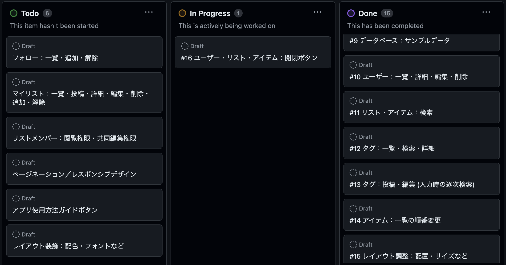

　※記載内容および画像は、全て開発中のもの。CSSによるレイアウト調整は未着手。  
 
 

# [ 1 ] アプリケーションの概要
## 1-1. 名称
　Five Level Tagging　(5段階タグ付けアプリ)  
 
 

## 1-2. 本番環境URL
　http://3.115.163.111/  
 
 

## 1-3. テスト用アカウント
　(1)企業風アカウント：user1　メールアドレス：aaaa@jp　パスワード：1aaaaaa8  

　(2)個人風アカウント：user2　メールアドレス：bbbb@jp　パスワード：2bbbbbb8  

　※Basic認証(ID/Pass)は、履歴書・職務経歴書に記載。  
 
　※テスト用アカウントにログインして閲覧する皆様へ  
　既存データ(サンプルデータ)の編集・削除はご遠慮ください。(user1~2, list1~6, item1~72)  
　新規データの投稿・編集・削除は問題ございません。データベースリセットの目安：平日22時頃  
 
 

## 1-4. 活用方法の概要
　(1)ユーザーが自由に決めたテーマに基づき、記録・発信したい情報を投稿できる(企業の業務や、個人の趣味)。  
　情報をまとめるページとして「リスト」を投稿する。リスト内の個々の情報として「アイテム」を投稿する。  

　(2)アイテムの特徴を示すキーワードとして「タグ」を投稿する。アイテム1つにつき、最大4つ。  
　タグの程度や段階を示す数値として、「1」~「5」の「スコア」を投稿する。  
　これにより、アイテムが持つ特徴を5段階の数値で表現し、データベース化できる。  

　(3)リストやアイテムの一覧表示を並び替える。  
　(※未実装)自作リストの場合、ドラッグ＆ドロップにより、アイテム一覧を任意の順番に並び替え、保存できる。  

　(4 ※未実装)ワード検索やタグ検索により、他ユーザーの投稿したリストやアイテムを表示する。  

　(5 ※未実装)他ユーザーをフォローする。直近で投稿・更新されたリストを、フォロー一覧から確認できる。  
　他ユーザーのリストをマイリスト登録し、一覧表示する。  
　自作リストの公開範囲を限定する。閲覧できるユーザーや、共同編集できるユーザーを指定できる。  
 
 

## 1-5. 活用例
　(1)音楽・書籍・映像など、鑑賞作品の評価項目と評価値をリスト化する。  
　「感動:1」「怖い:5」の映画  
 
　(2)食品リストを検索。おやつ献立の組み合わせを考えやすくする。満腹感のスコア合計6を目安にした場合↓  
　「満腹感:1」ミニゼリー＋「満腹感:2」薄焼きせんべい＋「満腹感:3」カットバウム  
　「満腹感:2」薄焼きせんべい＋「満腹感:4」カットロールケーキ  
　「満腹感:1」ミニゼリー＋「満腹感:5」肉まん  
 
　(3)小学生低学年向けの運動遊びリストを作成。難易度を数値化。運動遊びの実施時期・順番を考えやすくする。  
　「走る:1」ドーンじゃんけん  
　「走る:2」ハンカチ落とし  
　「避ける:1」おしり鬼ごっこ  
　「走る:3」「避ける:2」こおり鬼ごっこ  
　「狙う:1」ボール転がし的当て  
　「狙う:2」「避ける:3」転がしドッジボール  
　「狙う:2」「キャッチ:1」キャッチボール(ドッジ用ボール)  
　「狙う:2」「キャッチ:2」パスリレー(ドッジ用ボール)  
　「狙う:3」「キャッチ:3」アメリカンドッジボール  
　「狙う:4」「避ける:4」外野なしドッジボール  
　「狙う:4」「避ける:5」外野ありドッジボール  
　「走る:3」「狙う:5」「避ける:4」三歩ドッジボール  
 
 

## 1-6. 作成した背景
　保育士時代、過去のおやつ献立や遊び・行事の記録を参照したい時、毎月の献立表や個別の行事報告書を何枚もめくって探すような、アナログな環境だった。  
　改善策として、エクセルで記録を一覧化し、蓄積・検索しやすくした。  
　献立や遊びの特徴と評価値(タグとスコア)も簡潔に記録することで、保育を通じて児童に提供したい「体験」の組み合わせや順番に、意図を込めて計画しやすくなった。  

　便宜的・簡易的な数値化により、抽象的・曖昧な事柄についても、特徴の把握と比較・選択がしやすくなった。  
　ただし、当時はあくまでイチ施設内で完結する記録であった。  
 
　今回、特徴のタグ化・スコア化機能をアプリに落とし込めば、他ユーザーとの双方向性を強化できると考えた。  
　検索機能やフォロー機能を通じ、他者の投稿したリストを見て、自分と異なる経験やアイディア、価値観や価値基準に出会い、刺激やヒントを得られるチャンスが増える。  
　限定公開リスト機能を通じ、企業内やグループ内、あるいはネット上・アプリ上で知り合った人など、対象を指定して閲覧や共同編集ができる。  

　今回はリスト・タグのジャンルを限定しないことで、様々な業務や趣味の記録に活用できる汎用性を優先した。  
　(仮に大規模市場または特定業界向けに作成するなら、アプリのUIやデータベース設計を、特定のジャンル・ターゲットに寄せた方が実用的であると考えてはいる。)  
 
 
 

# [ 2 ] アプリケーションの機能
## 2-1. 実装済み
### 2-1-1. リストの投稿
　(1)トップページ(＝リスト一覧ページ)にアクセスする。ヘッダーからユーザー登録・ログインする。  
　(2)リスト新規投稿をクリックする。  
　(3)リストのタイトル・コンセプト・作成ルールを入力して投稿する。  
　※作成ルールには、タグのスコア1~5それぞれの段階・程度を表す言葉や代表例などの記載を推奨。  
 
/lists/new  

 
 
 

### 2-1-2. アイテム(リスト内の各項目)・タグ・スコアの投稿
　(1)リスト一覧ページで、自作のリストタイトルをクリックする。  
　(2)リスト詳細ページで、アイテム新規投稿をクリックする。  
　(3)アイテムの名前・説明、タグとスコア(最大4組)を入力して投稿する。画像も最大4枚添付できる。  

　※投稿可能：アイテムのみ。アイテム＋タグ。アイテム＋タグ＋スコア。  
　※投稿不可：タグのみ。スコアのみ。タグ＋スコア。  
 
/lists/1/items/new  

 
 
 

### 2-1-3. リスト一覧・アイテム一覧の並び替え
　(1)リスト一覧ページの並び替えボタン(列の見出し)をクリックするたびに、昇順・降順を切り替える(タイトル・作者名・更新日時)。  
 
/lists  
feature.png)
 
 
 

　(2)リスト詳細ページ(＝アイテム一覧)の並び替えボタンをクリックするたびに、昇順・降順を切り替える(アイテム名・更新日時)。  
　※アイテムに紐づくタグ・スコアも、アイテムとセットで並び替える。  

　※指定したタグのスコアによる並び替え機能は、下記2-2-6の機能として実装予定。  
 
/lists/1  
(A)feature.png)
 
(B)feature.png)
 
 
 

## 2-2. 実装予定
### 2-2-4. ユーザー詳細ページの表示
 

### 2-2-5. ワード検索：リスト・アイテムの表示
 

### 2-2-6. タグ検索
　(1)タグに紐づく全アイテムの表示。  
　(2)指定したリストとタグに紐づくアイテムの表示。指定したタグのスコアによる並び替え。  
 

### 2-2-2(4) タグ投稿：タグ入力時の逐次検索(JavaScript)
 

### 2-2-3(3) 自作アイテム一覧：ドラッグ＆ドロップによる並び替え、順番保存(JavaScript)
 

### 2-2-7. ユーザーのフォロー：各ユーザーが直近で更新したリストの表示
 

### 2-2-8. マイリスト登録
 

### 2-2-9. 限定公開リストの設定：閲覧できるユーザー／共同編集できるユーザー
 

### 2-2-10. アプリ使用方法ガイドの表示ボタン(JavaScript)
　※開発中の一時的な措置：使用方法の説明を、ビュー上では割愛している。現状ではREADMEに記載。  
　→ユーザー向けの説明は、一通りの機能実装後に着手する。  
 

### 2-2-11. レイアウト調整(CSS)
　※開発中の一時的な措置：HTMLで非推奨の調整をしている(brタグ、スペースキー空白、tableタグのサイズなど)  
　→CSSによるレイアウト調整は、一通りの機能実装後に着手する。  
 
 
 

# [ 3 ] 開発の概要
## 3-1. 要件定義
[リンク：Googleスプレッドシート](https://docs.google.com/spreadsheets/d/10B7zKWsc7uPWMbjWP8jSZ0URIDiKXv5PVb-Rytln0PM/edit?pli=1#gid=219665282)  
 
RequirementDefinition.png)
 
RequirementDefinition.png)
 
 
 

## 3-2. データベース設計
EntityRelationship.dio  

 
 
 

## 3-3. 画面遷移図
PageTransition.dio  

 
 
 

## 3-4. 開発環境
HTML・CSS・Ruby・JavaScript・MySQL・GitHub・AWS  
[リンク：GitHubリポジトリ](https://github.com/avocado-don/five_level_tagging)  
[リンク：GitHubプロジェクトボード](https://github.com/users/avocado-don/projects/2/views/1)　※各タスク内のメモ欄に、作業手順を記録している(自分向けの作業手順書)。  
 

 
 
 

## 3-5. ローカルでの動作方法
% git clone https://github.com/avocado-don/five_level_tagging  
% cd five_level_tagging  
% bundle install  
% yarn install  
 
 
 

# [ 4 ] 開発の工夫
## 4-1. 1つのアイテムに紐づく4組のタグとスコアを、アイテム投稿ボタン1クリックで保存可能にする
　上記「 [2] アプリケーションの機能」の「2-1-2. アイテム(リスト内の各項目)・タグ・スコアの投稿」に該当。  
 
 

### 4-1-1. テーブル設計：items, tags, item_tags(中間テーブルでもあり、scoreも保存する)

　カラムの正規化の観点から、アイテムテーブルのカラムに4つのタグやスコア(同種データ)を保存することは避ける。他のテーブルに4つずつのレコードとして保存する。  
　アイテムとタグの組み合わせが決まっている時にだけ、スコアの値も決定できる。アイテムとスコアのみ、あるいはタグとスコアのみを組み合わせて投稿するケースは存在しない。  
　従って、アイテムとタグの中間テーブルに、スコアカラムを設ける。(item_id, tag_id, score)  
 
　↓seeds.rbで投入したサンプルデータ(日本語の列は、外部キーと照合するためのメモ。投入はしていない)  
db/seeds/csv/item_tags.numbers  

 
 
 

### 4-1-2. アイテム投稿・編集フォーム：タグ・スコアの入力欄を4つずつ設置

　1つの入力欄内にてスペースやカンマでタグ名を区切る方法(複数タグの一括入力方式)は採用しない。  
　1つのタグ入力欄にどのスコア入力欄が紐づいているか、ユーザーの視覚・直感を考慮し、入力欄を並べた。  
 
/lists/1/items/3/edit　リスト：【小学生低学年】おやつ献立の候補食品　アイテム：フルーツゼリー	  

 
 
 

### 4-1-3. アイテム投稿・編集フォーム：タグ・スコアの入力値4つずつを、配列に入れて送信

　26: text_fieldのname属性を、item_form[tag_names][]に設定。  
　32: number_fieldのname属性を、item_form[scores][]に設定。  

　↓paramsのキーはitem_form、値は入れ子のハッシュ。ハッシュのキーはtag_namesとscores、値は配列。  
　Parameters: {"item_form"=>{"tag_names"=>["満腹感", "甘い", "のどごし", ""], "scores"=>["2", "1", "", ""]}}  
 
app/views/items/_form.html.erb  

 
 
 

### 4-1-4. ストロングパラメーター：配列の取得を許可

　42: params.require(:item_form).permit(tag_names: [], scores: [])に設定。  
 
app/controllers/items_controller.rb  

 
 
 

### 4-1-5. フォームオブジェクト(ItemForm)：配列の取得を許可
　8-9: attr_accessorメソッドで、配列tag_namesとscoresを指定。  
　配列から取り出した値を保存するカラムtag_nameとscoreも、別個に指定。  

　13-15: validatesも、配列とカラムについてそれぞれ設定。  
 
app/models/item_form.rb  

 
 
 

### 4-1-6. フォームオブジェクト(saveメソッド)：配列内の値を4つのレコードに分けて保存

　メソッド内で、アイテム→タグ→中間テーブル(スコアも含む)を順次保存する。アイテムはフォーム入力必須、タグとスコアはフォーム入力任意。  
 
　19: update_attributesメソッドを使い、アイテムの更新日時と同じ日時を、紐づくリストにも上書きする。  
　リストテーブルのカラムを直接更新したわけではないが、リストに紐づくアイテムが更新されたら、擬似的にリスト自体が更新された扱いとする。  
　リスト一覧ページにて更新日時を表示し、日時基準の並び替え機能も実装するため、そこに反映させたい。  
 
　21: タグの配列tag_namesにeach_with_indexメソッドを使う。  
 
　(1)eachの機能を活かした処理  
　22: 配列から順次取り出したtag_nameに値が入っている場合、タグの保存処理に移行する。  

　23: tag_nameにfirst_or_initializeメソッドを使う。同名のタグが過去に存在しない場合は、新規タグを保存する。存在する場合は、既存タグのIDを保存する。  

　30: タグがフォームに入力されていない場合、空の値も配列に含まれて送られてくるので、それをtag_nameとして取り出した際はタグを保存しない。  
　なお、タグに紐づかないスコアだけを保存するケースは存在しない(フォーム上でタグが空欄のまま、スコアが入力されたとしても保存しない)。アイテムのみ保存して処理を終了する。  
 
　(2)with_indexの機能を活かした処理  
　21: タグの配列に添字を付与する(i=0~3)。tag_names[0]を取り出している間は、同じ添字を使ってscores[0]も取り出せる。  

　25-26: タグに紐づいたスコアが存在している場合のみ、アイテム・タグの組み合わせをスコアと共に中間テーブルへ保存する。  
　27-28: タグは存在し、スコアは存在しない場合、アイテム・タグの組み合わせのみを保存する。  
 
app/models/item_form.rb  

 
 
 

### 4-1-7. editアクション：保存済みアイテムに紐づく複数のタグ・スコアを、配列として取得

　24: itemに紐づくtagsレコードのtag_nameカラムの値を、pluckメソッドで配列化。  
　25: itemに紐づくitem_tagsレコードのscoreカラムの値を、pluckメソッドで配列化。  
 
　※7-8: 後述の4-1-8実装のため、部分テンプレート(_form.html.erb)にて@item_formインスタンスを読み込むことにした。投稿画面のエラーを回避するうえで、newアクションでは空のインスタンスを用意する。  
　フォーム修正が必要になった場合の効率を考えて、フォームを投稿用と編集用に分離することは避けた。  
　他に適切な方法もありそうだが、限られた時間で考えた方法でエラー回避できたので、他の開発を優先したい。  
 
app/controllers/items_controller.rb  

 
 
 

### 4-1-8. アイテム編集フォーム：保存済みタグ・スコアの値を、複数の入力欄に自動入力

　23: 入力欄を4つ生成するための繰り返し処理(4.times)と同時に、ブロック変数(i)も生成しておく。配列の添字[i]として使う。  

　26: 配列@item_form.tag_namesから[i]番目の値を取り出し、入力欄の初期値(value)として表示する。  
　32: 配列@item_form.scoresから[i]番目の値を取り出し、入力欄の初期値(value)として表示する。  
 
app/views/items/_form.html.erb  

 
 
 

### 4-1-9. フォームオブジェクト(updateメソッド)：アイテム・タグ・スコアを更新

　35: アイテムとタグの既存の紐付け(item_tags)をいったん削除(destroy_all)する。  

　36-37: タグ・スコアをparamsから削除(delete)しつつ、その返り値を使ってタグ・スコアの配列(tag_names / scores)を定義する(後述の更新処理に使う)。  
　38: アイテムに関する情報だけが残ったparamsを使い、アイテムを更新する。  
 
　39: リスト更新日時の更新処理は、前述4-1-6のsaveメソッドと同様。  

　41-51: タグ・スコアの更新処理は、前述4-1-6のsaveメソッドと同様。  
 
app/models/item_form.rb  

 
 
 
